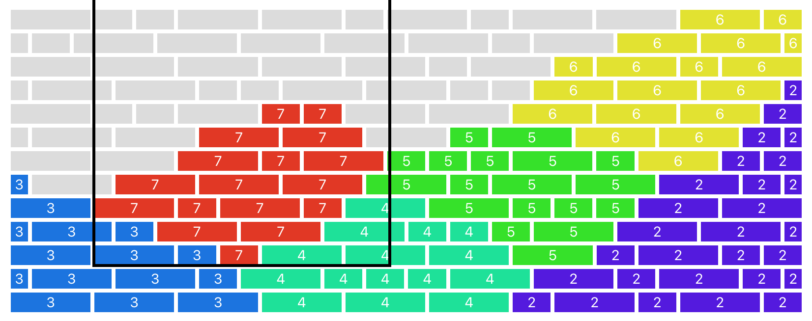
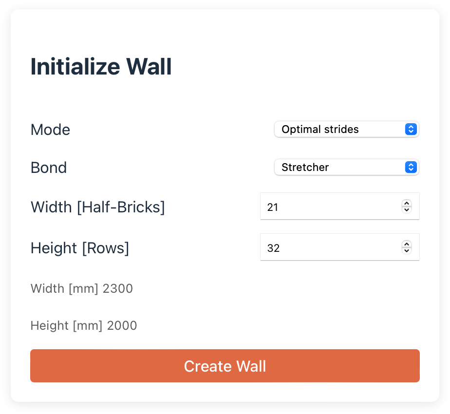

# 🧱 Another Brick in the Wall

A web app for visualizing and building brick walls



## Table of Contents
- [Setup](#setup)
- [Running](#running)
- [Stride strategy](#stride-strategy)
- [Development](#development)

## Setup

Backend requirements
```bash
python -m venv venv
source venv/bin/activate
pip install -r requirements.txt
``` 

Frontend requirements
```bash
cd frontend
npm install
npm run build
```

## Running

```bash
export PYTHONPATH=$(pwd)
python app.py
```

* Open <http://localhost:8000/> in your browser.
* Configure the wall size and bond type.
* Pick how bricks should be placed (left-to-right or using optimized strides)

Note: Wildverband patterns are implemented, but for large walls it's not guaranteed that a valid pattern can be found.




## Stride strategy

The strategy to find the optimal stride is implemented as a simple greedy algorithm:

1. Start in the bottom left corner
1. Place as many bricks as possible in the current stride
1. Find the first row that misses at least one brick
1. In that row, find the stride position that allows placing the maximum number of bricks
1. Move to that position and repeat from 2.

### Train of thought

- Continuing with the lowest row that has at least one brick missing is motivated by the fact that the wall is built from bottom to top and there is no alternative to returning to that row at some point.
- In that row, choosing the stride position that allows placing the maximum number of bricks is motivated by the fact that there is no extra cost for placing as many bricks as possible in on stride. At the same time, maximizing the number of bricks in on stride is a good proxy for minimizing the number of total strides.

### Outlook

- There could be strategies where choosing a stride with a smaller number of bricks is better, because it allows for more flexibility in the next row. 
- To identify such strategies, we can experiment with look-ahead and recursive optimization. I tried a recursive approach, but within the time constraints it was not feasible to implement without running into performance issues.

## Development

The frontend is built with React and Typescript. The main file is `frontend/src/App.tsx`, and the styles are in `frontend/src/styles.css`.

The backend is a simple Flask app. It uses a python lib that keeps track of the wall state and computes the optimal stride. The main files to review are `lib/bonds.py` and `lib/wall_state.py`.

### Debugging

Run the frontend in dev mode. This will automatically update when you save changes.
Remove the dist folder first to ensure flask does not host the frontend

```bash
rm -rf frontend/dist
```

Run the backend
```bash
export PYTHONPATH=$(pwd)
python backend/app
```

From another terminal, run the frontend in dev mode.
```bash
cd frontend
npm run dev 
```

Open <http://localhost:5173/> in your browser.

### Testing

```bash
pytest
```

Note: test coverage is not complete, while wall state is well tested, the bond lib is not.