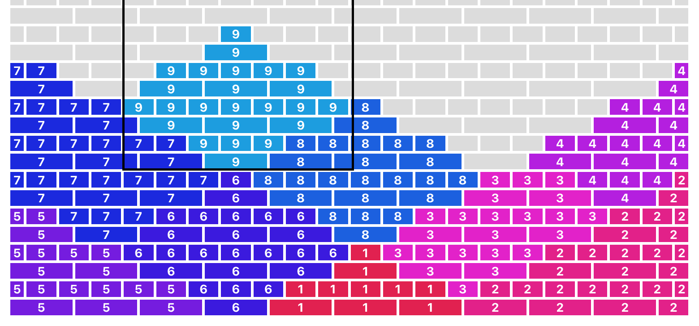
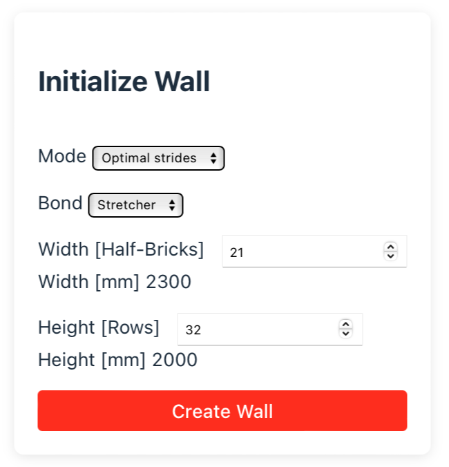

# Another Brick

A web app for visualizing and building brick walls.



## Setup

Backend requirements
```bash
python -m venv venv
source venv/bin/activate
pip install -r requirements.txt
``` 

Frontend requirements
```bash
cd frontend
npm install
npm run build
```

## Running

```bash
export PYTHONPATH=$(pwd)
python app.py
```

* Open <http://localhost:8000/> in your browser.
* Configure the wall size and bond type.
* Pick how bricks should be placed (left-to-right or using optimized strides)



### Stride strategy

The strategy to find the optimal stride is implemented as a simple greedy algorithm:

1. Start in the bottom left corner
1. Place as many bricks as possible in the current stride
1. Find the first row that misses at least one brick
1. In that row, find the stride position that allows placing the maximum number of bricks
1. Move to that position and repeat from 2.

## Development

Run the frontend in dev mode. This will automatically update when you save changes.
Remove the dist folder first to ensure flask does not host the frontend

```bash
rm -rf frontend/dist
```

Run the backend
```bash
export PYTHONPATH=$(pwd)
python backend/app
```

From another terminal, run the frontend in dev mode.
```bash
cd frontend
npm run dev 
```

Open <http://localhost:5173/> in your browser.

## Testing

```bash
pytest
```